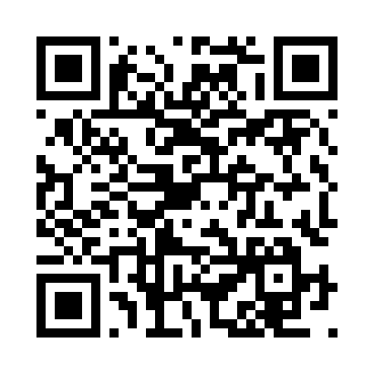

# Once a Wanderer's Contribution - Simple Profile

## எளியவர்களின் முயற்சி

A free, open-source desktop application for generating and visualizing **Market Profile** charts using **live data from Dhan API**.

  

---

## What is Market Profile?

Market Profile is a charting technique developed by J. Peter Steidlmayer at the Chicago Board of Trade. It organizes price and time data to show where the market spent the most time (Point of Control), the Value Area (where ~68% of trading occurred), and the structure of price acceptance/rejection throughout the session.

---

## Features

- **Live Data via Dhan API**
  - Fetch real-time 1-minute OHLCV data directly from Dhan
  - No need to download CSV files manually
  - Auto-refresh every 3 minutes (toggleable)

- **Profile Types**
  - **Daily** — Single day or multiple consecutive days (continuous mode)
  - **Weekly** — Groups days into weeks based on configurable week start day (ideal for Nifty expiry cycles)

- **Configurable Parameters**
  - Tick size, Bin size, TPO period, Value Area %
  - Initial Balance duration (default: first 1 hour)
  - Profile style: Merged (stacked TPO count) or Expanded (time x-axis with bracket letters)

- **Key Levels & Overlays**
  - POC (Point of Control) — highlighted in yellow
  - VAH / VAL (Value Area High / Low) with shading
  - Open / Close markers
  - Mid Point line
  - Initial Balance (IB) High & Low

- **Candlestick Chart**
  - TradingView Lightweight Charts integration
  - Multiple timeframes: 1min, 5min, 15min, 30min, 1hour, 4hours, 1day
  - Toggle on/off independently

- **Interactive Canvas**
  - Pan (drag on plot area)
  - Stretch price axis (drag on Y-axis)
  - Stretch time axis (drag on X-axis)
  - Zoom (mouse wheel)
  - Double-click to fit view
  - Crosshair with tooltips

- **Count Metrics**
  - TPO (bracket-based)
  - Minute density (1-min bar based)

- **Settings Dialog**
  - All parameters configurable
  - Show/Hide individual overlays (POC, VAH, VAL, Open, Close, Mid, IB)
  - Dhan API credentials storage

---

## Installation

### Prerequisites

- Python 3.10 or higher
- Dhan Trading Account (for API access)
- Internet connection (for TradingView Lightweight Charts CDN and Dhan API)

### Install Dependencies

```bash
pip install PySide6 pandas numpy qrcode[pil] requests
```

### Run

```bash
python app.pyw
```

### First-Time Setup

1. Launch the application
2. Click **Settings** button
3. Enter your **Dhan Client ID** and **Access Token**
4. Click **OK** to save credentials

Your credentials are stored securely in local settings and will be used for all subsequent live data fetches.

---

## How to Use

1. **Enter Security ID** — Default is Nifty Futures (1333), change as needed
2. **Set Periods** — Choose number of days (Daily) or weeks (Weekly)
3. **Select Profile Type** — Daily or Weekly
4. **Click Draw Profile** — Fetches live data from Dhan and renders the profile
5. **Toggle Auto 3min** — Enable auto-refresh every 3 minutes
6. **Click Settings** — Adjust parameters, overlays, candlestick options
7. **Interact** — Pan, zoom, stretch the chart like TradingView

---

## Disclaimer

This software is provided **as-is**. It may contain errors and is **not perfect**. It is meant for educational and personal use. Do not rely on it for trading decisions without independent verification.

---

## Credits

- **Developed with [Claude Code](https://claude.ai)** (Anthropic AI) — the entire codebase was written and iterated through AI-assisted development. Mostly Opus 4.6 + Sonnet 4.6
- This phase of development was driven by the need and desire of **Kaeswar** — kaeswar@gmail.com

---

## Contribute / Donate

This is **free to use** and **free to enhance**. If you find it useful, please consider contributing:

- **Code contributions** — Fork, improve, send a PR. All enhancements welcome.
- **Financial support** — A small contribution goes a long way in keeping this alive.

**UPI ID:** `kaeswar@oksbi`

Scan with GPay / PhonePe / Paytm:

<p align="center">
  
</p>

---

## License

Free to use. Free to enhance. Free to share. No restrictions.

---

*Built with Python, PySide6, TradingView Lightweight Charts, HTML5 Canvas & Dhan API.*
